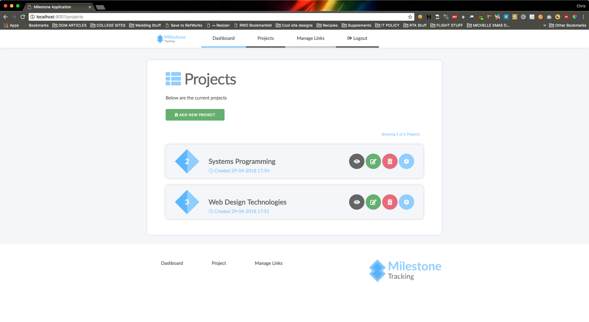
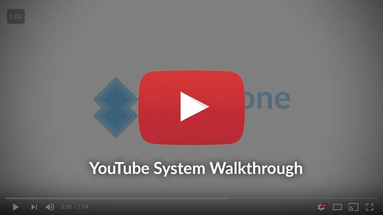

# Milestone Application #



This will be the repo for our WPD2 Coursework.
The application itself is a milestone application that allows users to have different projects that are made up of milestones. Users can only see their own projects and must log in to do so but can share them if they wish. 

## GROUP ID
```
GROUP ID: R
```

******

## Team Members
Below are the current team members

|Team Member |	Student ID	|	Email Address|
| --- | :---: | ---: |
|Christopher Connor	|	S1715477	|	Cconno208@caledonian.ac.uk|
|Daryl McAllister	|	S1222204	|	Dmcall200@caledonian.ac.uk|
|Gavin Macleod	|	S1715408	|	Gmacle204@caledonian.ac.uk|
|Niklas Olsson	|	S1434184	|	Nolsso200@caledonian.ac.uk|

******

## Completed Progress
We have successfully managed to implement all functional requirements included in the brief. 
* Project CRUD Functionality
* Milestone CRUD Functionality
* Shared Link Functionality
* User registration / login / logout
******
# YouTube Video Walkthrough
Below is a brief video walk through of our application
[](https://www.youtube.com/watch?v=zSgXbD4ZalE)
******
# Installation Instructions
To get the application running, you will need to have a MySQL database instance running. On the GCU lab machines, this can be done easily by running MySQL from XAMPP. Once running, simply install the `LATEST_DUMP.sql` script on the project root folder.

If the MySQL server is not using the default settings, you can update these in our application by changing the variables in the `ConnectionSupplier.java` file.

```java
    private static final String servername = "localhost";
    private static final int port = 3306;
    private static final String user = "root";
    private static final String pass = "";
    private static final String db = "milestones";
```
If you experience any issues, please contact cconno208@caledonian.ac.uk

******

# Dummy User Accounts
To test the application, there are two existing demo accounts:

|Email | Password|
| --- | --- |
| john@smith.com | password |
| paddy@takemeout.com | password |

# Internal Feature Help
Below are a list of instructions for the team on how to use any of the custom implemented code.

## FLASH MESSAGING
Flash messaging is a feature which allows you to write custom messages to the session which can be displayed and then wiped from the session straight away. This helps for sending and rendering messages across components / views.

### Message object
Message object looks like this
```java
public class FlashMessage {

    @Setter private FlashType type;
    private String heading;
    private String message;
    
}
```
`FlashType` has the following values which can be used:
```java
public enum FlashType {SUCCESS,WARNING,ERROR,INFO,BLANK};
```
### Writing a Flash Message to session
Writing a message to session is achieved like this by passing the `HttpServletRequest` as param 1, and `FlashMessage` object as param 2.
```java
SessionFunctions.setFlashMessage(request,new FlashMessage(FlashMessage.FlashType.SUCCESS,"Successfully logged in","Welcome back :)"));
```

### Retrieving a Flash Message
To retrieve, call a similar method like this:
```java
FlashMessage message = SessionFunctions.getFlashMessage(request);
```

### Mustache Partial
Whenever you want to render this message out in a view, make sure a following partial exists in the mustache template
```
{{>_partials/flash-message}}
```